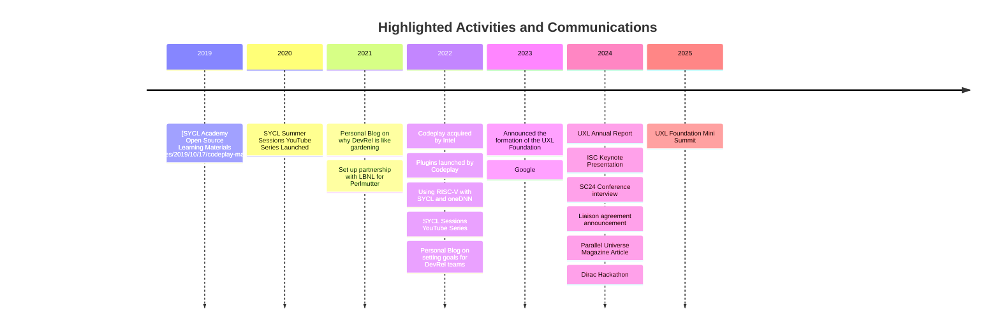

# About Me

  
2025
UXL Foundation mini summit https://ossna2025.sched.com/event/1zwlS/unified-acceleration-uxl-foundation-mini-summit-additional-fee-pre-registration-required?iframe=no&w=100%&sidebar=yes&bg=no
YouTube videos

2024
UXL Annual Report https://oneapi.io/wp-content/uploads/2024/12/UXL-Foundation-Annual-Report-2024.pdf

SC24 https://www.youtube.com/watch?v=X3gu47iTmVM&t=35s&pp=ygUNcm9kIGJ1cm5zIHV4bA%3D%3D

ISC24 https://youtu.be/eNNiqJM8AXY?si=LdfsL3yjDIzcfprj&t=537
https://x.com/addisonsnell/status/1790427152036335631

Liaison with Khronos https://www.khronos.org/blog/uxl-foundation-khronos-liaison-on-the-sycl-and-safety-critical-systems
https://www.eenewseurope.com/en/uxl-khronos-team-on-portable-safety-critical-sycl/

Parallel Universe https://www.intel.com/content/www/us/en/developer/articles/news/unified-acceleration-uxl-foundation.html
Parallel Universe 49 http://cdrdv2.intel.com/v1/dl/getContent/738487

Dirac hackathon https://codeplay.com/portal/news/2024/06/26/hosting-the-dirac-hackathon

2023
Led the creation of the UXL Foundation bringing Intel, Arm, Imagination... together
https://codeplay.com/portal/press-releases/2023/09/19/announcing-the-unified-acceleration-uxl-foundation

https://www.embedded.com/oneapi-motivates-new-foundation-for-open-standard-accelerated-compute/
https://insidehpc.com/2023/09/linux-foundation-unified-acceleration-foundation-formed-for-open-accelerated-compute-and-cross-platform-performance/
https://www.itopstimes.com/itops/linux-foundation-forms-new-group-to-drive-common-model-for-developing-cross-platform-applications/
https://www.phoronix.com/review/oneapi-uxl-foundation
https://techcrunch.com/2023/09/19/the-unified-acceleration-foundation-wants-to-create-an-open-standard-for-accelerator-programming/
https://www.techzine.eu/blogs/devops/111410/unified-acceleration-foundation-uxl-gives-oneapi-a-boost-and-more-governance/
https://thenewstack.io/oneapi-computing-aims-to-ease-multi-architecture-computing/
https://www.nextplatform.com/2023/09/19/the-new-uxl-foundations-has-bold-blueprint-for-open-acceleration/
https://www.runtime.news/the-race-for-an-nvidia-alternative/
https://www.heise.de/news/Mittwoch-Helfersuche-fuer-Google-Maps-Social-Engineering-fuer-Cyberangriffe-9310529.html
https://www.golem.de/sonstiges/zustimmung/auswahl.html?from=https%3A%2F%2Fwww.golem.de%2Fnews%2Funified-acceleration-uxl-foundation-linux-foundation-will-einheitlichen-beschleuniger-zugriff-2309-177802.html
https://www.eenewseurope.com/en/uxl-looks-to-standardise-heterogeneous-compute/
https://www.forbes.com/sites/tiriasresearch/2023/09/20/unified-acceleration-foundation-to-broaden-oneapis-use-for-heterogeneous-programming/?sh=77185c923056
https://www.computerweekly.com/blog/Open-Source-Insider/Cross-architecture-unification-Linux-Foundation-forms-Unified-Acceleration-UXL-Foundation
https://venturebeat.com/ai/intel-cto-highlights-open-and-secure-advances-for-ai-deployment/
https://siliconangle.com/2023/09/20/intel-samsung-chipmakers-back-new-accelerator-programming-initiative/

Foundation Announced at the Open Source Summit
https://www.youtube.com/watch?v=-zuphS0WDr4&t=28s&pp=ygUNcm9kIGJ1cm5zIHV4bA%3D%3D
https://www.youtube.com/live/Ha77rpusEDM?si=DuleizSkoIwZP3Cf&t=2598

https://codeplay.com/portal/blogs/2023/04/28/the-latest-on-sycl-in-cambridge-at-iwocl-and-syclcon

2022
Plugins launch https://codeplay.com/portal/press-releases/2022/12/16/codeplay-announces-oneapi-for-nvidia-and-amd-gpu-hardware

https://www.youtube.com/watch?v=iqPc1QM28yE
https://codeplay.com/portal/press-releases/2022/09/28/building-an-open-standard-heterogeneous-software-platform-on-oneapi
SYCL sessions https://codeplay.com/portal/blogs/2022/04/14/sycl-sessions-episode-2-accelerators-for-the-atlas-cern-project https://codeplay.com/portal/blogs/2022/02/21/sycl-session-episode-1-sycl-helping-to-accelerate-simulation-for-cern-researchers

Setting goals for devrel https://rodburns.medium.com/setting-goals-for-developer-relations-c996061a7c1

2021
RVV https://codeplay.com/portal/videos/2021/10/01/codeplay-with-risc-v-vector

Perlmutter https://codeplay.com/portal/press-releases/2021/02/02/nersc-alcf-codeplay-partner-on-sycl-for-next-generation-supercomputers

Gardening is a lot like developer relations https://rodburns.medium.com/gardening-is-a-lot-like-developer-relations-e0aafc2057c2

2020
SYCL Summer Sessions https://codeplay.com/portal/blogs/2020/09/09/sycl-sessions-20

2019
SYCL Academy made open source https://codeplay.com/portal/press-releases/2019/10/17/codeplay-makes-sycl-academy-materials-free-and-open-source

2018

2017

2016

2015
https://inmarsat.sched.com/list/simple
https://x.com/rodburns/status/555044381728968704

Symbian - Book - https://www.oreilly.com/library/view/developing-software-for/9780470725702/pr05.html
