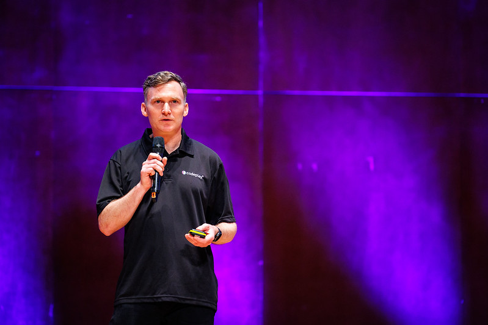

# Rod Burns

 I am a results-oriented leader with experience in a range of industries throughout my career including mobile, games development, embedded, HPC and AI. I have planned and executed strategies to grow developer ecosystems around technologies, most recently leading the formation of the UXL Foundation, a Linux Foundation project focused on unified, vendor neutral libraries for AI and HPC developers. I retain my technical focus by building small demos and projects to ensure I can see the world through the eyes of the developer community.
